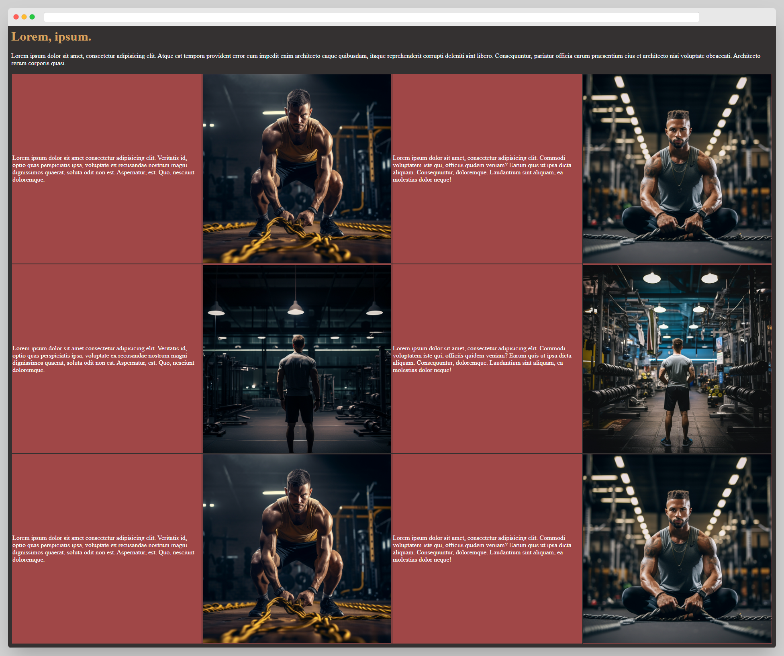
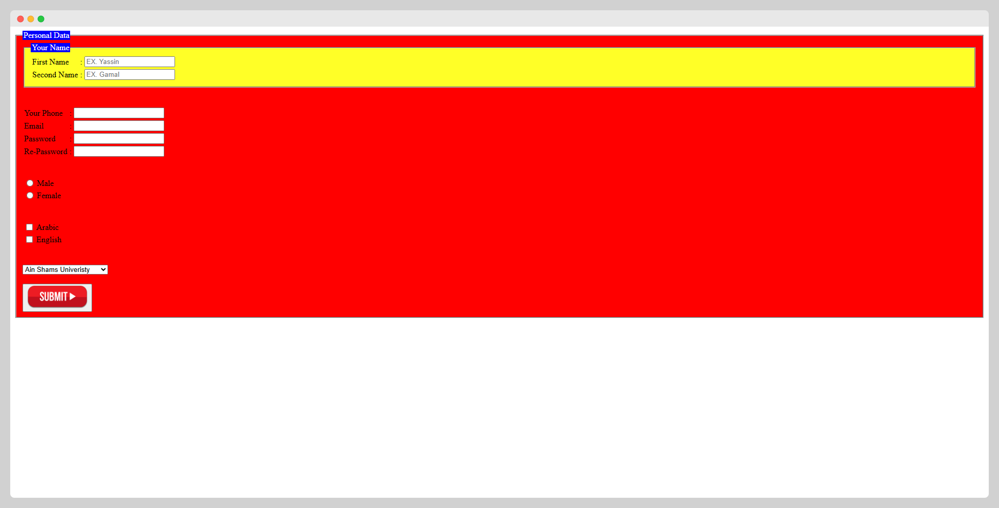
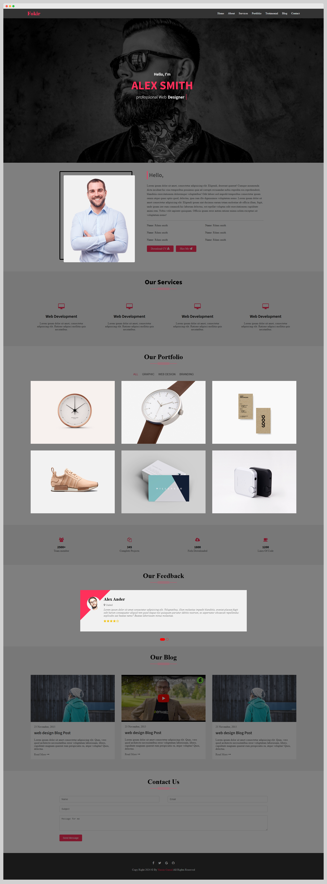
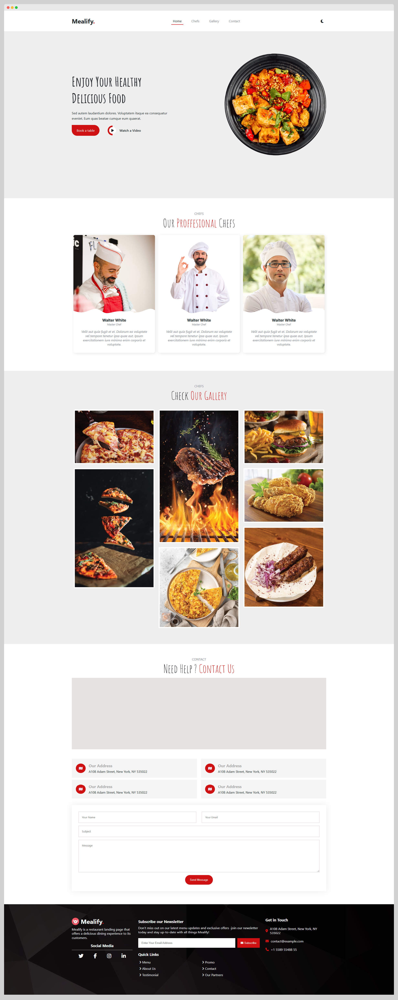
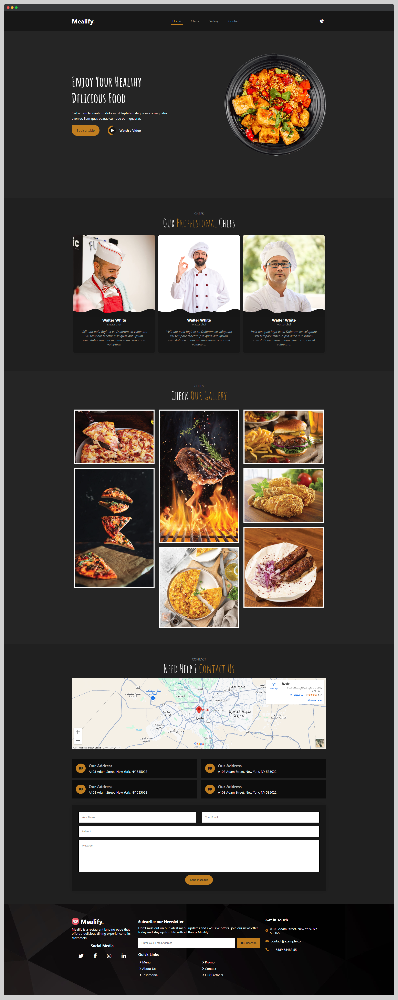
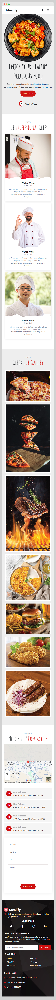
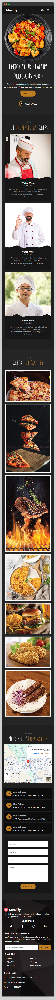

# Full-Stack Route Course Assignments 💻

Welcome to my repository! Here, you will find all my completed assignments from the **Full-Stack Route Course**. Each assignment covers key web development concepts, ranging from front-end to back-end tasks.

## 🚀 Course Overview
The Route Full-Stack course provides training in front-end and back-end development. It covers:
- HTML, CSS, and JavaScript
- Responsive design and advanced layout techniques
- JavaScript frameworks and libraries
- Back-end development with databases and server-side languages

## 📂 Assignments

Here are the links to my assignments:

### Front-End Assignments:
- 🔗 [Assignment 01: Front-End](https://yassinsultan.github.io/Route-Course/Front-End/Assigment-01/)
  

    
screensgot

    
  

    
- 🔗 [Assignment 02: Front-End](https://yassinsultan.github.io/Route-Course/Front-End/Assigment-02/)
  - 
 
    
- 🔗 [Assignment 03: Front-End](https://yassinsultan.github.io/Route-Course/Front-End/Assigment-03/)
  - 
 
    
- 🔗 [Assignment 04: Front-End](https://yassinsultan.github.io/Route-Course/Front-End/Assigment-04/)
  - 

    
- 🔗 [Assignment 05: Front-End](https://yassinsultan.github.io/Route-Course/Front-End/Assigment-05/)
  - 
  - 
  - 
  - 

### Back-End Assignments:
- ❌  No Back-End assignments yet.

## 🛠️ Technologies Used
- 
- 
- 

Feel free to explore each project and see the live demo by clicking the links!
